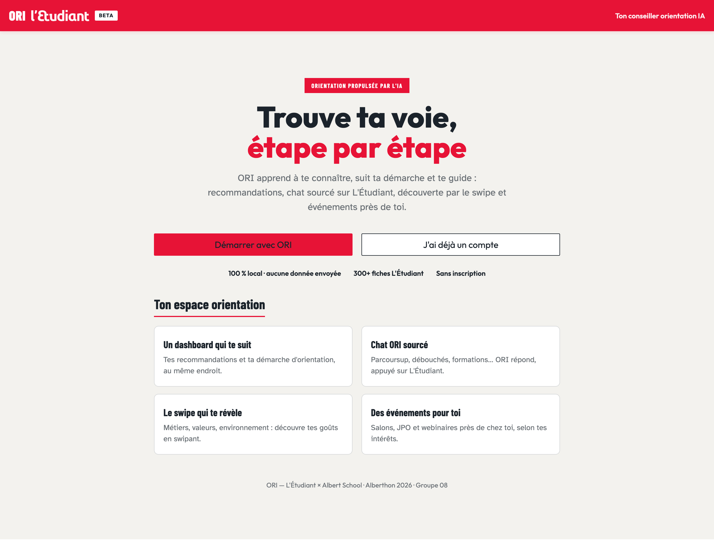
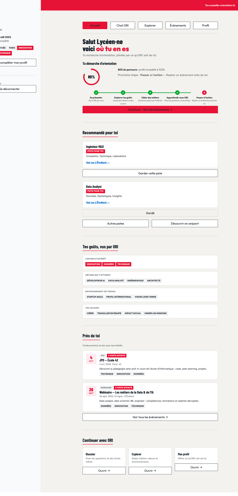
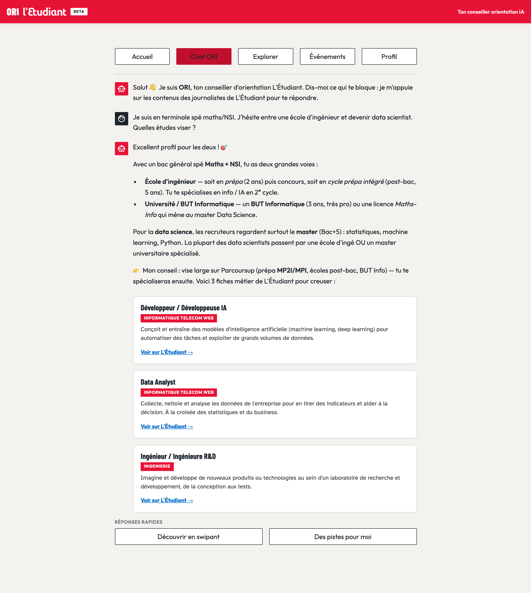
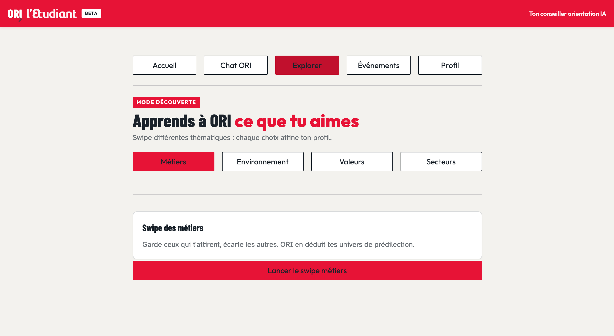
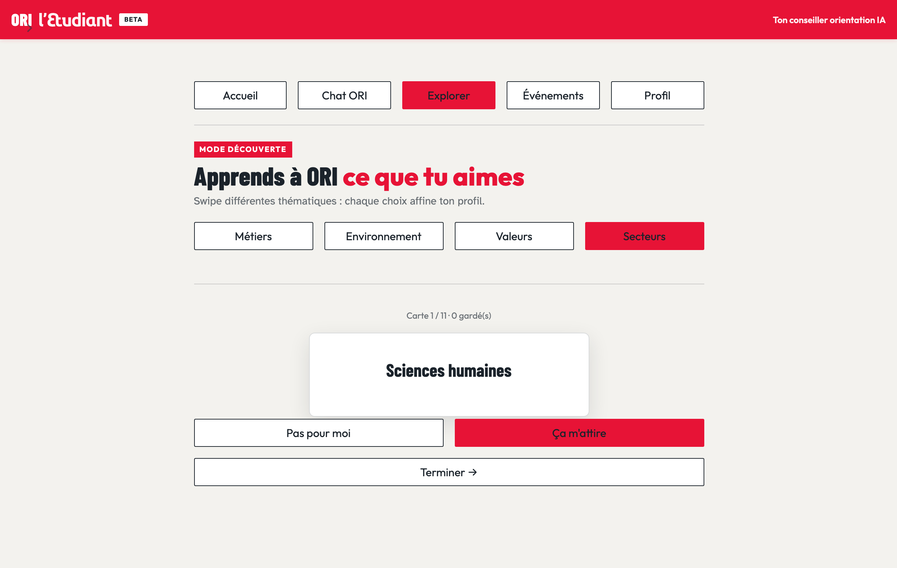
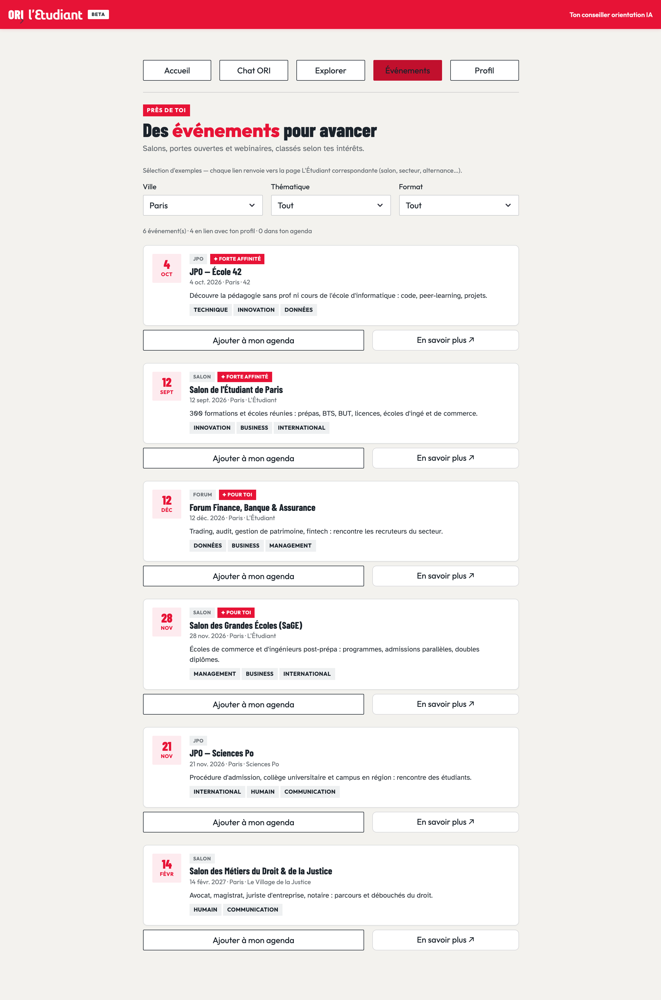
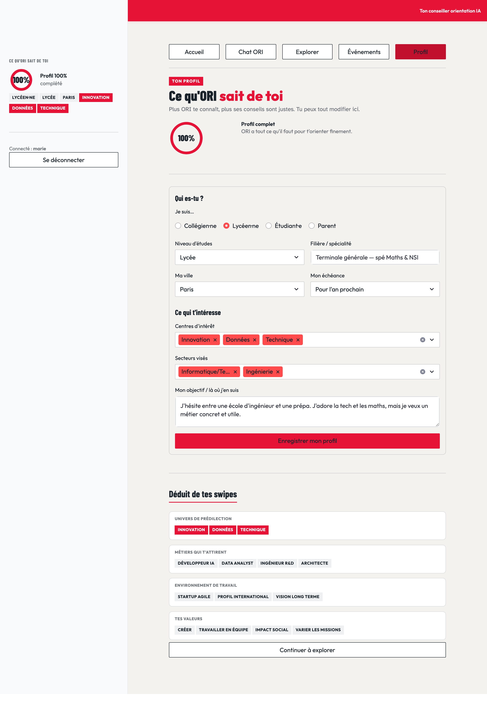
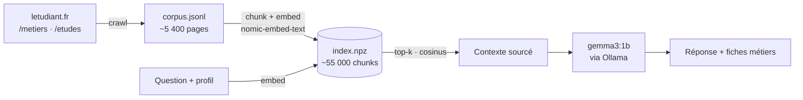

<p align="center">
  
</p>

<h1 align="center">ORI — de l'information à la décision</h1>

<p align="center">
  <b>Assistant d'orientation L'Étudiant</b> — un espace personnel qui apprend à te connaître<br>
  pour t'amener à une décision <i>éclairée</i>, sourcée sur les contenus de L'Étudiant.
</p>

<p align="center">
  
  
  
  
</p>

<p align="center">
  <sub>Alberthon 2026 · Thème 1 — ORI · L'Étudiant × Albert School · Groupe 08</sub>
</p>

---

## Sommaire

1. [**Le produit** — vision business](#1-le-produit--vision-business)
2. [**Sous le capot** — l'essentiel technique](#2-sous-le-capot--lessentiel-technique)
3. [**Démarrer** — installer & lancer](#3-démarrer--installer--lancer)

---

# 1. Le produit — vision business

## 1.1 Le contexte

**ORI** est le compagnon d'orientation conversationnel de **L'Étudiant** : il accompagne les jeunes,
du collège à l'entrée dans la vie active, avec des réponses personnalisées, fiables et **souveraines**,
alimentées exclusivement par la richesse éditoriale du média (guides, classements, fiches métiers,
fiches établissements…).

À ce jour, ORI a déjà fait ses preuves côté **information** :

|  Conversations  |  Messages échangés  |  En mode connecté  |
|:---:|:---:|:---:|
| **52 764** | **169 715** | **24 %** |

<sub>Chiffres d'usage de la plateforme ORI au 26 mars 2026 (source : brief Alberthon Thème 1).</sub>

## 1.2 Le problème à résoudre

ORI sait **informer**. Mais répondre à une question ne suffit pas à **choisir une voie**. Le brief de
l'Alberthon fixe un cap clair :

> **Comment faire qu'ORI soit un compagnon fiable pour amener l'utilisateur à une prise de
> décision personnelle et éclairée grâce à l'information de L'Étudiant ?**

Trois objectifs en découlent :

1. **Étendre ORI de l'information jusqu'à la prise de décision.**
2. Proposer une **navigation et une restitution innovantes**.
3. Offrir l'expérience la plus **originale et unique** possible.

**Cibles** : collégiens · lycéens · étudiants · parents — avec un focus sur les élèves de **1ʳᵉ/Terminale**
et les étudiants en **réorientation**.

## 1.3 Notre réponse & sa philosophie

> **ORI devient un espace personnel qui apprend à te connaître.**

Là où un chatbot classique traite chaque question isolément, ORI fait **graviter toute l'expérience
autour de la connaissance de l'utilisateur**. Le **profil** est le cœur du produit : **chaque page le
lit pour personnaliser, et l'enrichit en retour**. Plus tu utilises ORI, mieux il t'oriente — et plus
il te rapproche d'une **décision**, pas seulement d'une réponse.

Deux principes guident le produit :

- **Souveraineté & confiance** — tout tourne **100 % en local** (modèle + index), **aucune API cloud,
  aucune clé secrète, aucune donnée envoyée**. Les réponses restent **sourcées sur letudiant.fr**.
- **Résilience** — chaque page reste utilisable **même sans IA** grâce à des *fallbacks* (decks
  statiques, recommandations locales) : jamais d'écran vide en démo.

## 1.4 Le workflow : transformer une recherche en parcours

Pour passer « de l'info à la décision », ORI matérialise l'orientation en une **démarche guidée en
5 étapes**, suivie en temps réel sur le dashboard. L'utilisateur voit toujours **où il en est** et
**quelle est la prochaine action concrète**.

<p align="center">
  
  <br><sub><b>Le dashboard</b> : suivi de la démarche, recommandations personnalisées, « tes goûts vus par ORI » et événements à proximité — le tout dérivé du profil.</sub>
</p>

## 1.5 Les fonctionnalités

### Chat ORI — la réponse, sourcée

Questions Parcoursup, débouchés, formations… ORI répond en s'appuyant sur un **RAG** branché sur
letudiant.fr, et fait remonter de **vraies fiches métiers** cliquables. La conversation propose des
**réponses rapides** qui guident vers l'action (swiper, demander des pistes…).

<p align="center">
  
</p>

### Explorer — la découverte par le swipe

La **navigation innovante** demandée par le brief : un mode « Tinder de l'orientation » sur plusieurs
thématiques (**métiers, environnement de travail, valeurs, secteurs**). Chaque swipe affine le profil
sans que l'utilisateur ait à « savoir ce qu'il veut » au départ.

<table>
  <tr>
    <td width="50%"></td>
    <td width="50%"></td>
  </tr>
</table>

### Événements — le passage à l'action

Salons, JPO, forums et webinaires **classés par affinité** avec les intérêts de l'utilisateur
(badges « Forte affinité »), filtrables par ville / thématique / format, et ajoutables à un **agenda**.
C'est l'étape qui transforme une intention en **décision concrète**.

<p align="center">
  
</p>

### Profil — « ce qu'ORI sait de toi »

La colonne vertébrale, **éditable et transparente** : l'utilisateur déclare qui il est, et ORI lui
**montre ce qu'il a déduit** de ses swipes (univers de prédilection, métiers qui l'attirent,
environnement, valeurs). Un **taux de complétion** encourage à enrichir le profil.

<p align="center">
  
</p>

## 1.6 Notre proposition de valeur

| | ORI classique | **ORI, version Groupe 08** |
|---|---|---|
| **Finalité** | Informer (Q&A) | **Décider** (démarche guidée en 5 étapes) |
| **Navigation** | Conversation linéaire | + **swipe**, dashboard, frise, événements |
| **Personnalisation** | Historique de conversation | **Profil central** lu & enrichi par chaque page |
| **Restitution** | Texte | Texte **+ cartes, badges d'affinité, insights, agenda** |
| **Confiance** | Réponses sourcées | Sourcé **+ 100 % local & souverain**, sans donnée envoyée |

---

# 2. Sous le capot — l'essentiel technique

**Stack** : [Streamlit](https://streamlit.io) (UI) · **RAG maison** sur letudiant.fr · [Ollama](https://ollama.com)
en local (`gemma3:1b` pour la génération, `nomic-embed-text` pour les embeddings) · `numpy` pour la
similarité cosinus. Aucune base de données externe, aucun service cloud.

### Le RAG en un coup d'œil



1. **Crawl** — `rag/crawler.py` parcourt les sections *métiers* & *études* de letudiant.fr (`robots.txt`
   respecté) → `data/rag/corpus.jsonl`.
2. **Index** — `rag/index.py` découpe en chunks et calcule les embeddings → `data/rag/index.npz`.
3. **Réponse** — `ai.py` récupère les chunks pertinents (similarité cosinus) et les injecte dans le
   prompt envoyé à `gemma3:1b`.

### Quelques choix d'ingénierie

- **Fiabilité avec un petit modèle** — `gemma3:1b` est léger ; on le sécurise avec des **sorties
  structurées** (schémas JSON imposés à Ollama) pour les suggestions et les decks de swipe.
- **Fiches sans hors-sujet** — pour les cartes métiers, la requête RAG est *ciblée* (retrait des mots
  génériques du gabarit des fiches) puis **vérifiée lexicalement** : on n'affiche jamais une fiche qui
  ne parle pas vraiment du métier demandé.
- **Réactivité** — le deck de swipe est **préchargé en arrière-plan** (thread) pendant que l'utilisateur
  navigue ; les recommandations sont **mises en cache** par signature de goûts.
- **Dégradation gracieuse** — si Ollama est indisponible, decks statiques et recommandations locales
  prennent le relais.

### Architecture du code

| Fichier / dossier | Rôle |
|---|---|
| `app.py` | Point d'entrée & routeur (accueil, auth, dashboard, chat, explorer, événements, profil) |
| `config.py` | Configuration Streamlit & CSS (charte graphique L'Étudiant — « DS Tomato ») |
| `components.py` | Shell : barre d'onglets, sidebar profil + composants (anneau, frise, cartes) |
| `engine.py` | Logique pure : complétion du profil, suivi de la démarche, matching d'événements |
| `ai.py` | Couche IA : RAG + génération (réponses, suggestions, deck de swipe, fiches) |
| `data.py` | Taxonomies de profil, decks de swipe et événements (mock local) |
| `db.py` · `utils.py` | Persistance des comptes (`data/users.json`) · état de session & navigation |
| `views/` | Une vue par page : `dashboard`, `chat`, `explore`, `events`, `profile`, `home`, `auth` |
| `rag/` | RAG local : `crawler`, `index`, `ollama_client`, `build`, `settings` |
| `ressources/` | Référence de la charte graphique L'Étudiant (`design_systeme_letudiant.html`) |

---

# 3. Démarrer — installer & lancer

### Prérequis

- **Python 3.10+**
- **[Ollama](https://ollama.com)** installé et lancé (`ollama serve`)

### 1. Dépendances & modèles

```sh
# Dépendances Python
pip install -r requirements.txt

# Modèles Ollama (génération + embeddings)
ollama pull gemma3:1b
ollama pull nomic-embed-text
```

### 2. Construire le RAG

Crawle letudiant.fr (sections métiers & études) puis construit l'index d'embeddings :

```sh
python -m rag.build
```

Les fichiers générés (`corpus.jsonl`, `index.npz`, `chunks.json`) sont écrits dans `data/rag/`.

### 3. Lancer l'application

```sh
streamlit run app.py
```

L'app s'ouvre sur [http://localhost:8501](http://localhost:8501). Tu peux **entrer en mode invité**
(sans inscription) ou créer un compte pour sauvegarder ta progression.

### Configuration (optionnelle)

Variables d'environnement (voir `rag/settings.py`) :

| Variable | Défaut | Rôle |
|---|---|---|
| `OLLAMA_HOST` | `http://localhost:11434` | Hôte du serveur Ollama |
| `RAG_GEN_MODEL` | `gemma3:1b` | Modèle de génération |
| `RAG_EMBED_MODEL` | `nomic-embed-text` | Modèle d'embeddings |

---

<p align="center"><sub>ORI — L'Étudiant × Albert School · Alberthon 2026 · Groupe 08</sub></p>
